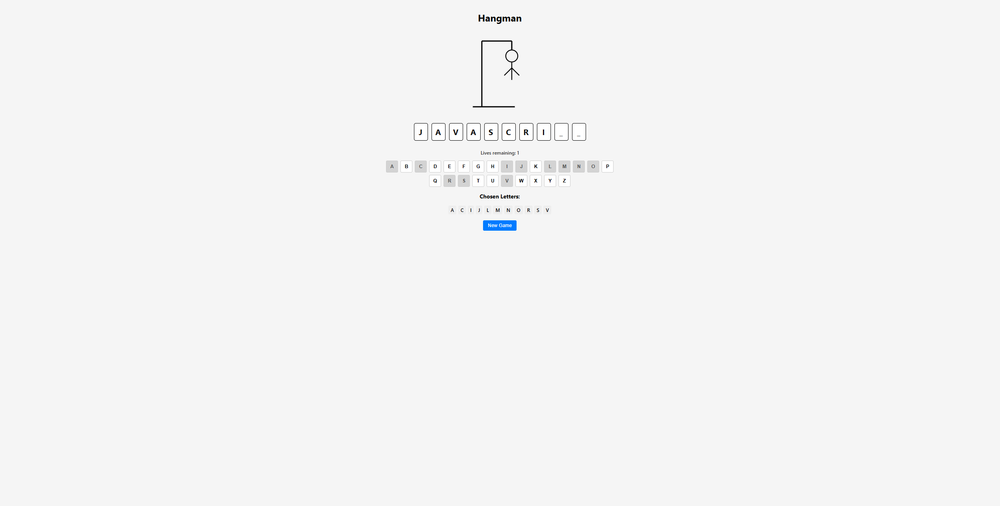

## Features

- **Current Hangman Figure:** PNG-based drawing that adds a body part for each wrong guess.
- **On-Screen Keyboard:** Clickable/touchable keyboard for letter selection, plus physical keyboard support.
- **Used Letters Display:** Shows all letters the user has already chosen.
- **New Game Button:** Instantly starts a new round with a random word.
- **Win/Lose Pop-Up:** Modal dialog indicating whether the game is won or lost, and revealing the word.

## Tech Stack

- **Frontend:** React (Vite)
- **Styling:** Plain CSS
- **Containerization:** Docker 

## Getting Started (Local)

```bash
# 1. Install dependencies
npm install

# 2. Run dev server
npm run dev

# Build image
docker build -t hangman-vite-react .

# Run container
docker run -p 5173:80 hangman-vite-react


